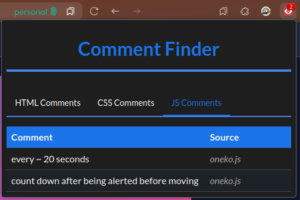
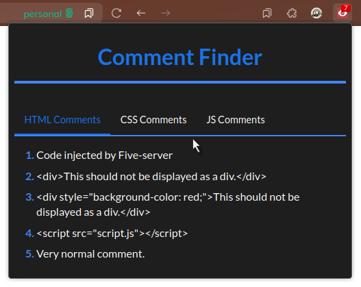

# Comment Finder

A simple browser extension to find HTML, CSS, and JavaScript comments on a webpage. This extension was made to fit my personal preferences and needs, so you may not like it, however I simply can't care. If you need a feature just create an issue and I might consider adding it or create a pull request with the feature implemented.

## Installation

1. Get it from the addons page from mozilla (recommended).

You can find the extension on the [Firefox Add-ons page](https://addons.mozilla.org/en-US/firefox/addon/html-comment-finder/)

2. From source code.

Since this is a Firefox-specific extension, you'll need to load it as a temporary add-on. Here are the steps to install it:

1. Clone or download this repository.
2. Open Firefox and navigate to `about:debugging`.
3. Click on "This Firefox".
4. Click on "Load Temporary Add-on...".
5. Select the `manifest.json` file from the cloned repository.

The extension is now installed and will remain active until you close Firefox.

## About this extension

This extension is a fork of a fork of the original: [HTML Comment Finder](https://github.com/dimdenGD/html-comment-finder). This version is made for Firefox (*not chrome!*) It might not be of the best quality, but it works for me.

## Showcase

## Features

- [x] Find HTML comments.
- [x] Display comments in a popup when the extension icon is clicked.
- [x] Display the number of comments found on the extension icon.
- [X] Find CSS comments.
- [X] Find JavaScript comments.
- [ ] Add a feature to copy comments to the clipboard.
- [ ] Improve the UI of the popup.
- [ ] Add a settings page to customize the extension.
- [ ] Add a search feature to find specific comments.
